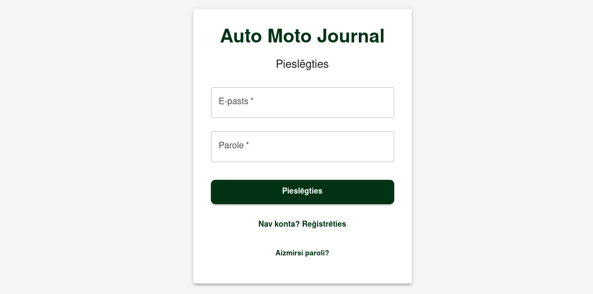
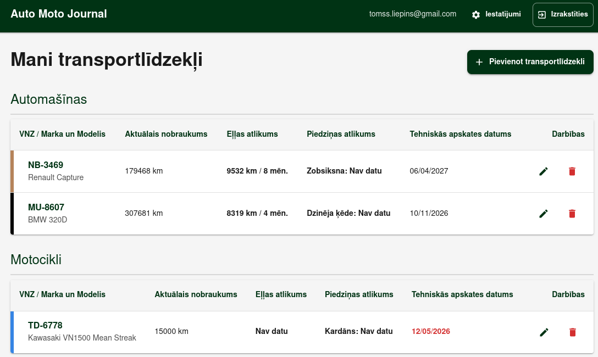
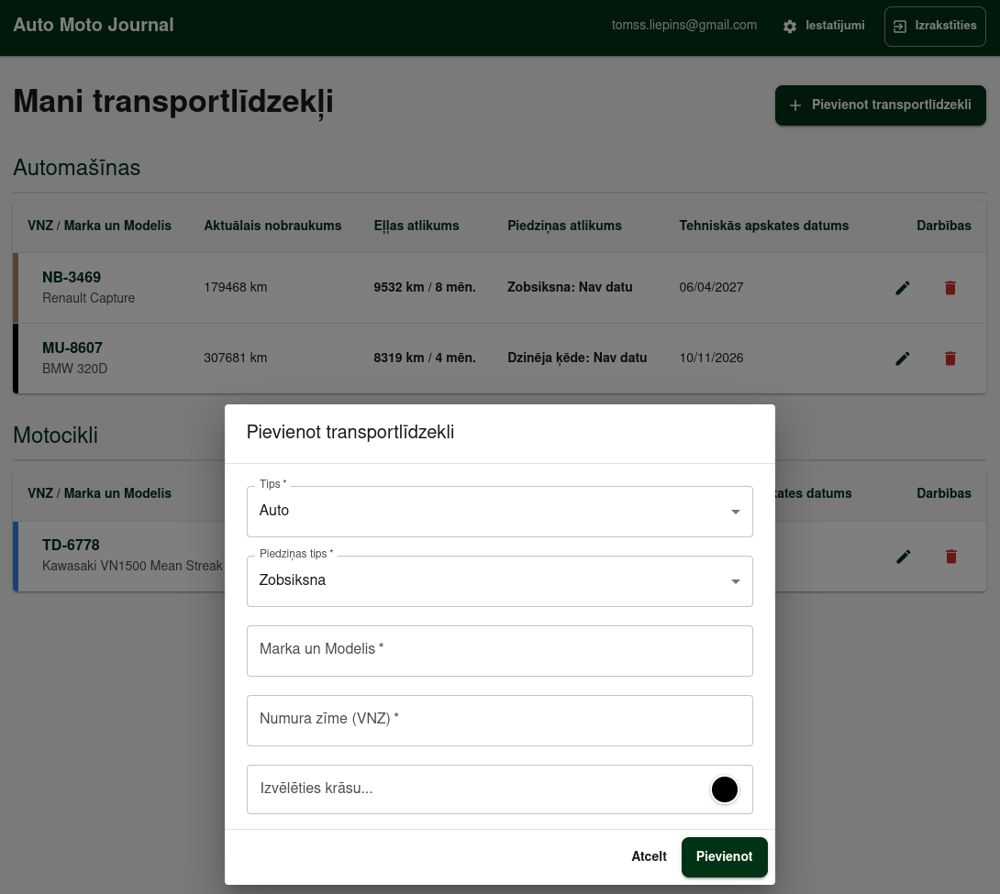
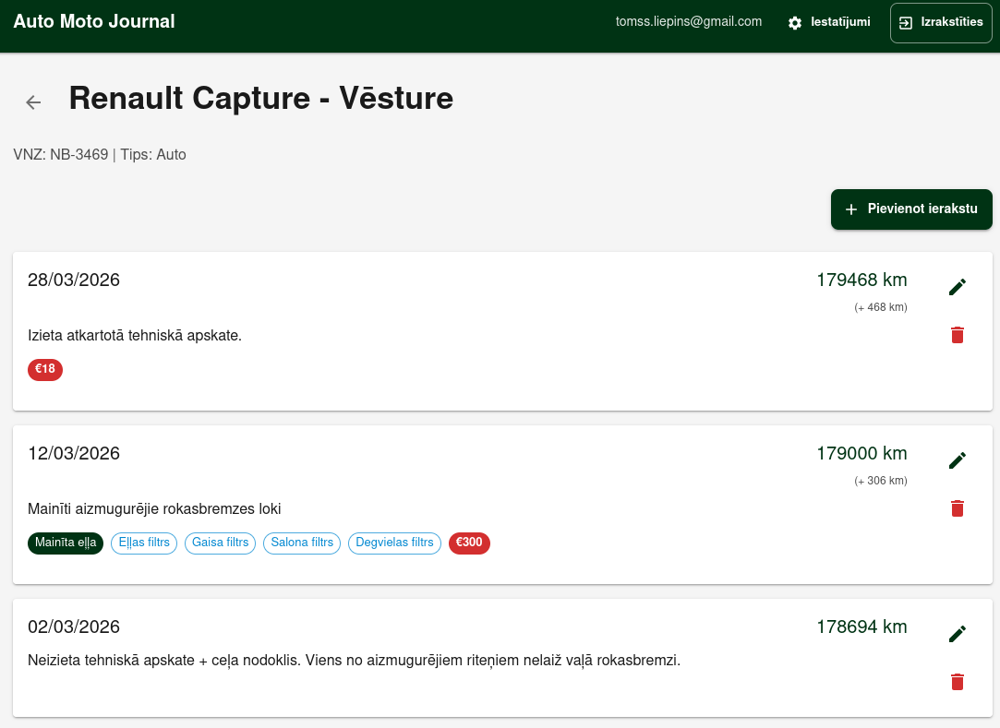
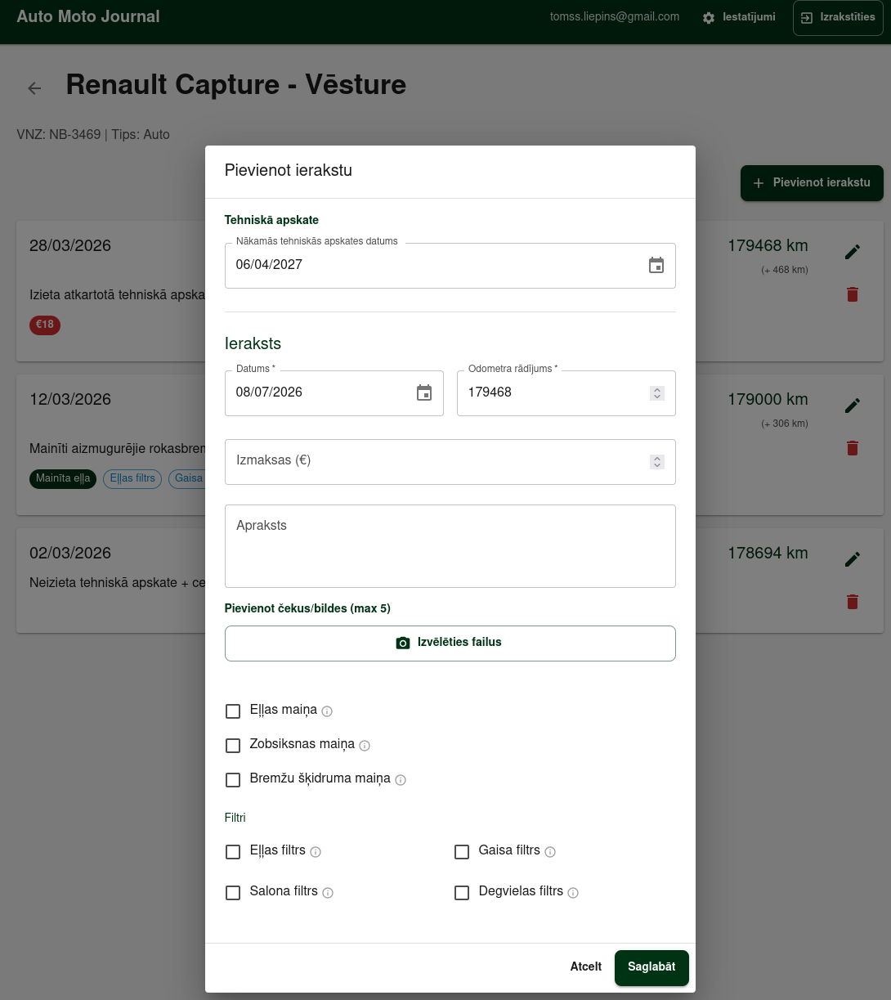

# Transportlīdzekļu Apkopes Žurnāls (Web App) — Projekta Vizītkarte

Šis repozitorijs ir izveidots kā publiska vizītkarte un tehniskā dokumentācija manis izstrādātajai un testētajai transportlīdzekļu apkopes tīmekļa lietotnei. Drošības un datu privātuma apsvērumu dēļ lietotnes pamatkods ir privāts, taču šis apraksts sniedz pilnvērtīgu ieskatu sistēmas arhitektūrā, biznesa loģikā un kvalitātes nodrošināšanas (QA) procesos.

## 1. Projekta Pārskats & Mērķis
Šī lietotne risinājums ģimenes autoparka tehnisko apkopju izsekošanai. Tā automatizē periodisko servisa darbu (eļļas, gaisa, salona un degvielas filtru maiņa, zobsiksnas vai dzinēja ķēdes kontrole, bremžu sistēmas apkope u.c.) uzskaiti, sekojot līdzi diviem kritiskiem parametriem vienlaicīgi: transportlīdzekļa nobraukumam (km) un laikam (mēnešiem).

## 2. Tehnoloģiskais Steks & Arhitektūra
* **Frontend:** Dinamiska tīmekļa saskarne ar responsīvu dizainu, kas pielāgota lietošanai gan no viedtālruņa, gan no datora.
* **Backend & Datubāze (Supabase):** Datubāzes un mākoņpakalpojumu platforma Supabase, kas nodrošina drošu datu uzskaiti un PostgreSQL relāciju datubāzes jaudu. Šeit tiek glabāta informācija par transportlīdzekļiem, servisa vēsturi un katras apkopes specifiskajiem intervāliem.
* **Izstrādes metodoloģija:** Projektā aktīvi izmantota "Vibe Coding" pieeja, kurā es definēju striktas sistēmas prasības, datu validācijas un loģikas slāņus, izmantojot mākslīgā intelekta aģentus kā primāro izpildmehānismu.

## 3. Galvenā Biznesa Loģika & Datu Validācija
Lietotnes sarežģītākā daļa ir apkopju brīdinājumu loģika, kas seko līdzi intervāliem. Nākamās apkopes slieksnis katram darbam (piemēram, eļļas maiņai) tiek rēķināts sekojoši:

Nākamā_Apkope_Km = Pēdējā_Apkope_Km + Apkopes_Intervāls_Km
Nākamā_Apkope_Datums = Pēdējā_Apkope_Datums + Apkopes_Intervāls_Mēneši

Brīdinājuma statuss mainās dinamiski:
* **Zaļš:** Viss kārtībā, limits nav sasniegts.
* **Dzeltens:** Apkope tuvojas (atlikuši < 1000 km vai < 30 dienas līdz termiņam).
* **Sarkans:** Apkope ir nokavēta (pārsniegts laika termiņš vai nobraukuma limits, kā tas redzams motocikla tehniskās apskates datumam).

## 4. Kvalitātes Nodrošināšanas (QA) un Testēšanas Stratēģija
Kā QA veicu pilnu šīs lietotnes integrācijas un funkcionālo testēšanu, īpašu uzmanību pievēršot robežvērtību analīzei (Boundary Value Analysis):
* **Datu ievades validācija:** Testēti negatīvie scenāriji, lai nepieļautu negatīvu nobraukumu ievadi vai nākotnes datumus vēsturiskajos ierakstos.
* **Intervālu pārklāšanās:** Pārbaudīts, kā sistēma reaģē, ja laika termiņš vēl nav pienācis, bet nobraukuma limits jau ir pārsniegts (un otrādi). Sistēmai nostrādā dzeltenais/sarkanais brīdinājums pēc tā parametra, kurš izpildās pirmais (piemēram, eļļas maiņai pienāk 8 mēnešu laika limits pirms nobraukti 10 000 km).
* **Stāvokļu pārejas:** Validēta savlaicīga statusu krāsu maiņa pie precīzām robežvērtībām.

## 5. Lietotnes Saskarnes Ekrānuzņēmumi (UI Screenshots)

  <b>1. Autorizācijas logs (Login screen)</b> 
   
  <i>Lietotne nodrošina autorizāciju un lietotāju datu nodalīšanu.</i>

  <b>2. Galvenais panelis (Dashboard)</b> 
   
  <i>Pārskatāms ģimenes autoparka statuss. Uzskatāms rezultāts: Kawasaki motociklam tehniskās apskates datums ir iekrāsots sarkanā krāsā (12/05/2026), jo termiņš ir nokavēts.</i>

  <b>3. Transportlīdzekļa pievienošana</b> 
   
  <i>Forma jauna transportlīdzekļa reģistrēšanai, piedāvājot izvēlēties specifiskus piedziņas tipus (zobsiksna, dzinēja ķēde, kardāns).</i>

  <b>4. Apkopes un servisa vēsture (Vehicle History)</b> 
   
  <i>Detalizēta servisa vēsture ar izmaksu uzskaiti, veiktajiem darbiem un nobraukuma pieauguma dinamiku starp ierakstiem (+468 km, +306 km). Pievienoti tagi (eļļas maiņa, filtri) kā pārskatāms vizuālais uzskates materiāls.</i>

  <b>5. Jauna servisa ieraksta pievienošana un parametri</b> 
   
  <i>Datu ievades forma ar čeku/bilžu augšupielādes limitiem un kontrolsarakstiem (Checkboxes) eļļas maiņas, filtru vai specifisku piedziņas sistēmu reģistrēšanai, kas kalpo kā datu avots brīdinājumu sistēmai.</i>

